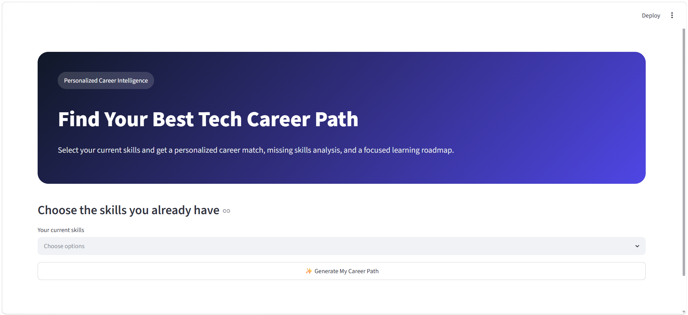
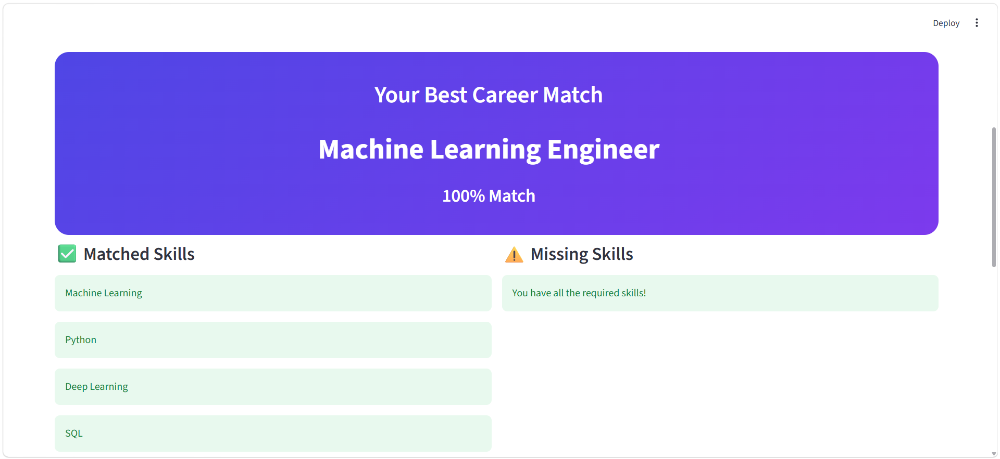
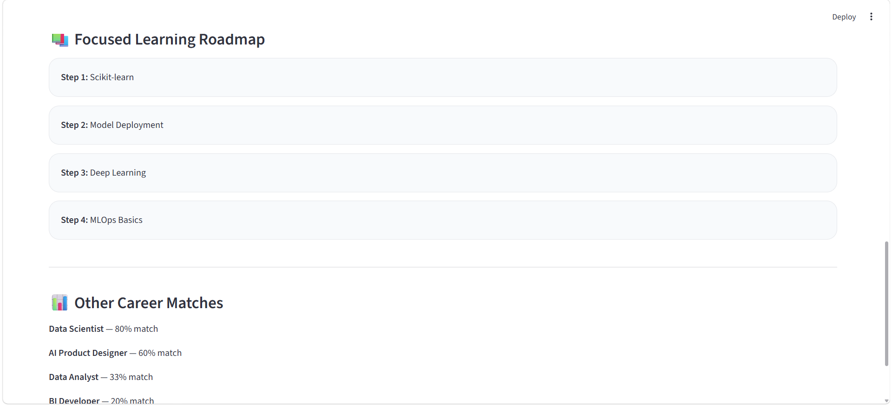

# 🚀 AI Career Advisor

## 📌 Project Overview

AI Career Advisor is an interactive application that analyzes a user's current skills and recommends the most suitable technology career path.

The application identifies skill gaps and generates a personalized learning roadmap.

---

## 🎯 Problem Statement

Many beginners in technology struggle to identify which career path best matches their current skills.

This project helps users discover potential career directions and understand what skills they need to develop next.

---

## 🚀 Features

* Skill-based career matching
* Personalized recommendations
* Skill gap analysis
* Learning roadmap generation
* Interactive Streamlit interface

---

## 🛠️ Technologies Used

* Python
* Streamlit
* Pandas

---

## 📷 Application Preview






## 💡 Career Paths Included

* Data Analyst
* Data Scientist
* Machine Learning Engineer
* BI Developer
* AI Product Designer

---

## 📁 Project Structure

```text
ai-career-advisor/
├── app.py
├── requirements.txt
├── README.md
├── home.png
└── result.png
```

---

## 🌟 Future Improvements

* Add more career paths
* Personalized learning resources
* Integration with job market trends
* Resume analysis features
